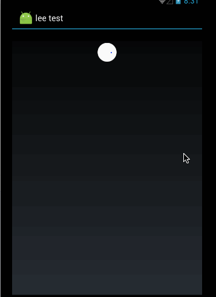

控件说明
==============
### 功能如下

### 用了哪些控件
SwipeRefreshLayout, RecyclerView

### 为什么不把 swipe menu 和 SwipeRefreshLayout直接融合
直接融合是可以的
但是做这个控件的目的就是用尽量少的代码来完成我所需要的功能

### 有哪些功能
下拉刷新， 上拉加载更多， 和侧滑

### 可以扩展的
侧滑的扩展， 左右侧滑机制
对下拉刷新的动画和加载更多的动画的编写

### 参考了哪些控件
参考列表如下
> 1. https://github.com/cymcsg/UltimateRecyclerView
> 2. https://github.com/baoyongzhang/SwipeMenuListView
> 3. 动画可以参考 https://github.com/lsjwzh/MaterialLoadingProgressBar

